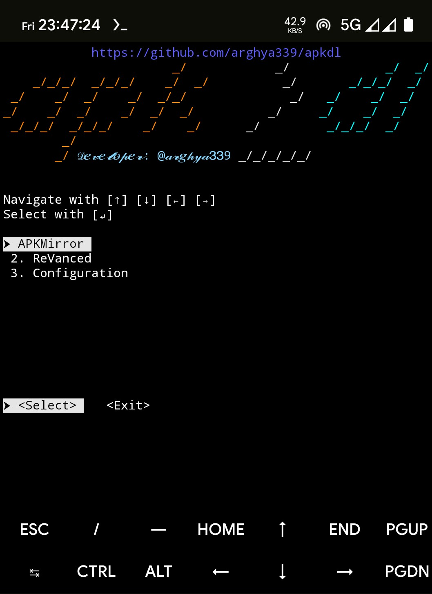

<h1 align="center">apkdl</h1>
<p align="center">
apk downloader
<br>
<br>

<br>

## Purpose
- This script automates process of downloading apk file using shell script.

## Supported sources
- [PlayStore](https://play.google.com/store/apps/)
- [GitHub](https://github.com/)
- [GitLab](https://gitlab.com/)
- [F-Droid](https://f-droid.org/)
- [APKMirror](https://apkmirror.com/)
- [Uptodown](https://en.uptodown.com/)
- [APKPure](https://apkpure.com/)
- otherSources
  - [Codeberg](https://codeberg.org/)
  - [IzzyOnDroid](https://apt.izzysoft.de/fdroid/)
  - [AppGallery](https://appgallery.huawei.com/)
  - [SourceForge](https://sourceforge.net/)
  - [APKCombo](https://apkcombo.com/)
  - [Aptoide](https://en.aptoide.com/group/applications/)
  - [LITEAPKS](https://liteapks.com/)
  - [APKDONE](https://apkdone.com/)
- [ReVanced](https://revanced.app/)
- [Morphe](https://github.com/MorpheApp/morphe-patches/)
- [RVX](https://github.com/inotia00/revanced-patches/)

## Prerequisites
- macOS/ Android device with working internet connection.

## Usage
###   
  Open macOS Terminal/ Android [Termux](https://github.com/termux/termux-app/releases/) & run script with following command:
  ```sh
  curl -L --progress-bar -o "$HOME/.apkdl.sh" "https://raw.githubusercontent.com/arghya339/apkdl/main/bash/apkdl.sh" && bash ~/.apkdl.sh
  ```
  Run apkdl with these commands in Terminal/ Termux:
  ```
  apkdl
  ```
> [!NOTE]
> This script was tested on an arm64-v8a device running Android 14 with Termux v0.118.3 with bash v5.2.37(1).

> [!NOTE]
> This script was tested on an Intel Mac running macOS Sonoma (14) with Terminal v2.14(453) with bash v5.3.3(1).

## How it works (_[Demo on YouTube](https://youtube.com/)_)

## Developer: [@arghya339](https://github.com/arghya339)